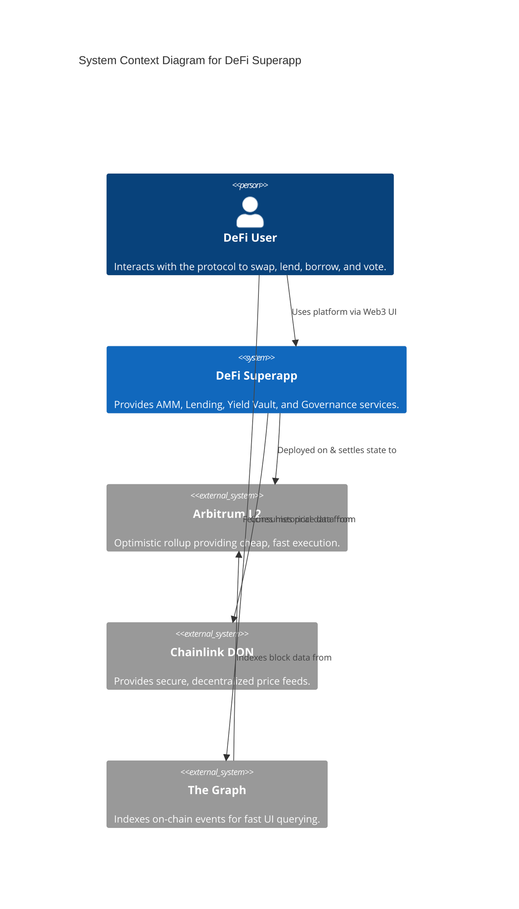
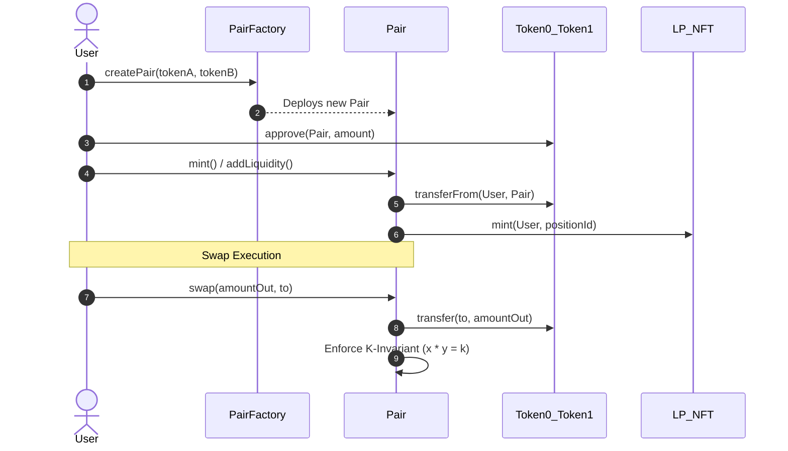
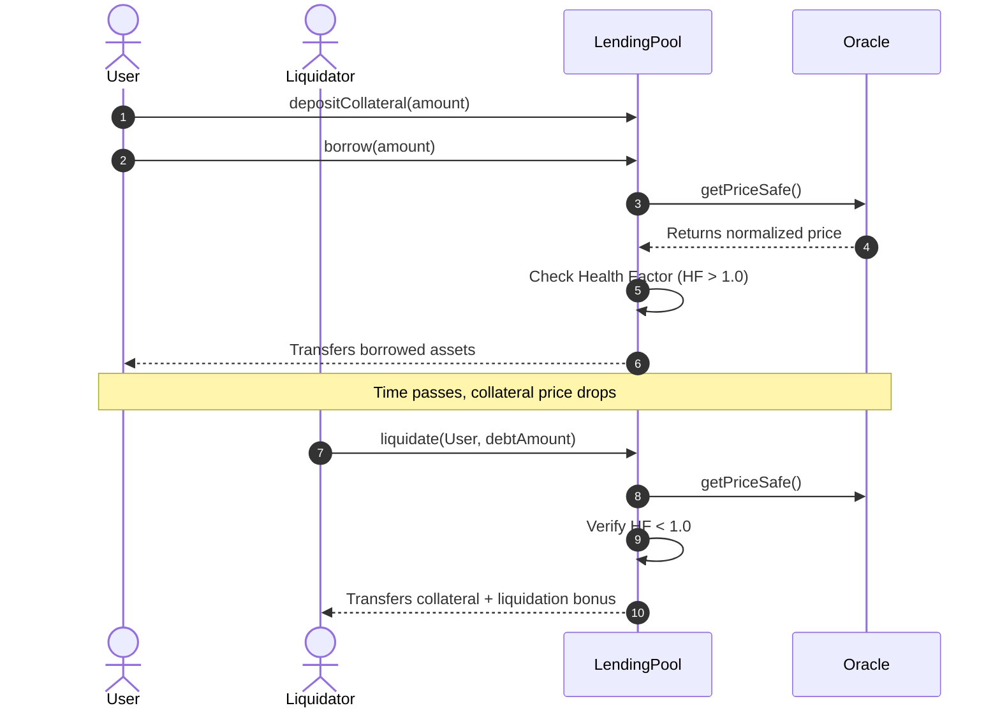
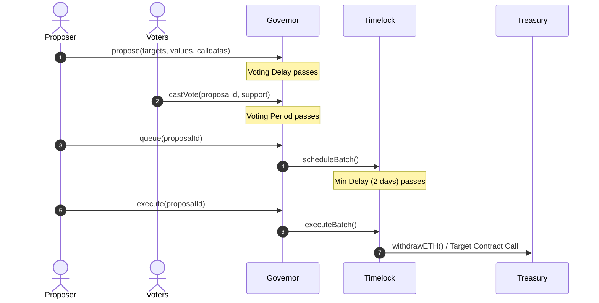

```markdown
# Architecture & Technical Design Document
**Project:** DeFi Superapp  
**Version:** 1.0  

This document outlines the high-level architecture, container interactions, sequence flows, smart contract storage layouts, trust assumptions, and historical Architecture Decision Records (ADRs) for the DeFi Superapp.

---

## 1. System Architecture (C4 Model)

### 1.1. Level 1: System Context Diagram
The System Context diagram shows the DeFi Superapp in its broader ecosystem, interacting with end-users, Layer 2 infrastructure, and external decentralized oracle networks.



### 1.2. Level 2: Container Diagram

This diagram drills down into the DeFi Superapp, showing the primary smart contract modules and their interactions.

```mermaid
C4Container
    title Container Diagram for DeFi Superapp

    Person(user, "DeFi User", "Trader, Lender, Borrower, or Voter")
    
    Container(frontend, "Web Application", "React / Next.js", "Provides the user interface.")
    
    Boundary(c1, "Smart Contract Protocol") {
        Container(amm, "AMM Module", "Pair, PairFactory", "Handles token swaps and liquidity.")
        Container(lending, "Lending Module", "LendingPool", "Overcollateralized borrowing and liquidations.")
        Container(vault, "Yield Vault", "YieldVault (ERC4626)", "Auto-compounds yields.")
        Container(gov, "Governance", "Governor, Timelock", "On-chain DAO mechanics.")
        Container(treasury, "Treasury", "TreasuryV1 (UUPS)", "Holds protocol fees.")
        Container(tokens, "Token Layer", "ERC20, LP NFT", "Platform tokens and positions.")
    }

    ContainerDb(graphNode, "Subgraph", "GraphQL", "Indexed blockchain state.")
    Container_Ext(oracle, "Chainlink Oracle", "Price Feeds", "External price data.")

    Rel(user, frontend, "Interacts with")
    Rel(frontend, amm, "Swaps / Adds Liquidity")
    Rel(frontend, lending, "Deposits / Borrows")
    Rel(frontend, gov, "Proposes / Votes")
    Rel(amm, tokens, "Transfers")
    Rel(lending, oracle, "Fetches Prices")
    Rel(lending, tokens, "Locks Collateral")
    Rel(vault, lending, "Supplies Idle Assets")
    Rel(gov, treasury, "Executes Payouts")
    Rel(amm, treasury, "Sends swap fees to")
    Rel(graphNode, c1, "Listens to Events")
    Rel(frontend, graphNode, "Queries state")

```

---

## 2. Core Sequence Flows

### 2.1. AMM Swap & Liquidity Flow



### 2.2. Lending & Liquidation Flow



### 2.3. Governance Lifecycle



---

## 3. Storage Layouts

Understanding storage layouts is critical for proxy upgradeability (avoiding storage collisions) and gas optimization (slot packing). Below are the specific storage layouts generated via `forge inspect`.

### 3.1. YieldVault Storage

| Name | Type | Slot | Offset | Bytes |
| --- | --- | --- | --- | --- |
| `_balances` | `mapping(address => uint256)` | 0 | 0 | 32 |
| `_allowances` | `mapping(address => mapping(address => uint256))` | 1 | 0 | 32 |
| `_totalSupply` | `uint256` | 2 | 0 | 32 |
| `_name` | `string` | 3 | 0 | 32 |
| `_symbol` | `string` | 4 | 0 | 32 |
| `_paused` | `bool` | 5 | 0 | 1 |
| `_roles` | `mapping(bytes32 => struct AccessControl.RoleData)` | 6 | 0 | 32 |
| `principalSupplied` | `uint256` | 7 | 0 | 32 |

### 3.2. ProtocolGovernor Storage

| Name | Type | Slot | Offset | Bytes |
| --- | --- | --- | --- | --- |
| `_nameFallback` | `string` | 0 | 0 | 32 |
| `_versionFallback` | `string` | 1 | 0 | 32 |
| `_nonces` | `mapping(address => uint256)` | 2 | 0 | 32 |
| `_name` | `string` | 3 | 0 | 32 |
| `_proposals` | `mapping(uint256 => ProposalCore)` | 4 | 0 | 32 |
| `_governanceCall` | `Bytes32Deque` | 5 | 0 | 64 |
| `_proposalThreshold` | `uint256` | 7 | 0 | 32 |
| `_votingDelay` | `uint48` | 8 | 0 | 6 |
| `_votingPeriod` | `uint32` | 8 | 6 | 4 |
| `_proposalVotes` | `mapping(uint256 => ProposalVote)` | 9 | 0 | 32 |
| `_quorumNumeratorHistory` | `Trace208` | 10 | 0 | 32 |
| `_timelock` | `TimelockController` | 11 | 0 | 20 |
| `_timelockIds` | `mapping(uint256 => bytes32)` | 12 | 0 | 32 |

### 3.3. LendingPool Storage

| Name | Type | Slot | Offset | Bytes |
| --- | --- | --- | --- | --- |
| `_paused` | `bool` | 0 | 0 | 1 |
| `_roles` | `mapping(bytes32 => RoleData)` | 1 | 0 | 32 |
| `positions` | `mapping(address => Position)` | 2 | 0 | 32 |
| `totalDebt` | `uint256` | 3 | 0 | 32 |
| `totalDebtShares` | `uint256` | 4 | 0 | 32 |
| `totalCollateral` | `uint256` | 5 | 0 | 32 |
| `borrowIndex` | `uint256` | 6 | 0 | 32 |
| `lastUpdate` | `uint256` | 7 | 0 | 32 |
| `totalLiquidityShares` | `uint256` | 8 | 0 | 32 |
| `liquidityShares` | `mapping(address => uint256)` | 9 | 0 | 32 |

### 3.4. PairFactory Storage

| Name | Type | Slot | Offset | Bytes |
| --- | --- | --- | --- | --- |
| `_roles` | `mapping(bytes32 => RoleData)` | 0 | 0 | 32 |
| `getPair` | `mapping(address => mapping(address => address))` | 1 | 0 | 32 |
| `allPairs` | `address[]` | 2 | 0 | 32 |

### 3.5. ProtocolTimelock Storage

| Name | Type | Slot | Offset | Bytes |
| --- | --- | --- | --- | --- |
| `_roles` | `mapping(bytes32 => RoleData)` | 0 | 0 | 32 |
| `_timestamps` | `mapping(bytes32 => uint256)` | 1 | 0 | 32 |
| `_minDelay` | `uint256` | 2 | 0 | 32 |

---

## 4. Trust Assumptions & Threat Model

The protocol relies on several core trust assumptions to function securely:

1. **L2 Sequencer Liveness:** We assume the Arbitrum L2 sequencer operates reliably. If the sequencer goes down, oracle price feeds will stale, triggering the `stalenessThreshold` protections and pausing liquidations until the network recovers.
2. **Oracle Integrity:** The protocol blindly trusts the `ChainlinkPriceOracle` logic. We assume Chainlink node operators will not collude to report false prices. A compromised oracle can drain the LendingPool by artificially inflating collateral value.
3. **Admin Keys (Post-Deployment):** Upon deployment, the `DEFAULT_ADMIN_ROLE` for the Treasury and protocol settings must be renounced to the `ProtocolTimelock`. If a developer retains the admin key, the protocol is highly centralized and vulnerable to rug pulls.
4. **Smart Contract Risk:** Despite 90%+ test coverage, invariants, and fuzzing, we assume the inherent risk of undiscovered compiler bugs (Solc 0.8.24) or EVM-level edge cases.

---

## 5. Architecture Decision Records (ADRs)

### ADR 1: Foundry vs Hardhat

* **Context:** The team needed a smart contract development framework.
* **Options:** Hardhat (JavaScript/TypeScript), Foundry (Solidity), Brownie (Python).
* **Decision:** **Foundry.**
* **Consequences:** We achieved 10x faster compilation times and native Solidity testing. It allowed us to easily write invariant/fuzz tests, which caught edge cases in our AMM math that Hardhat would have missed.

### ADR 2: UUPS vs Transparent Proxies

* **Context:** The `Treasury` contract holds protocol fees and requires future upgradeability.
* **Options:** Transparent Upgradeable Proxy (TUP) or Universal Upgradeable Proxy Standard (UUPS - ERC1822).
* **Decision:** **UUPS.**
* **Consequences:** UUPS places the upgrade logic inside the implementation contract rather than the proxy. This reduces the gas cost of every single call to the Treasury, as the proxy is lightweight.

### ADR 3: Arbitrum Sepolia vs Alternatives

* **Context:** Choosing a testnet/L2 for deployment.
* **Options:** Ethereum Goerli/Sepolia, Optimism, Arbitrum, Polygon.
* **Decision:** **Arbitrum Sepolia.**
* **Consequences:** Arbitrum currently holds the highest TVL among L2s. Deploying here allowed us to test real-world optimistic rollup sequencer delays and significantly reduced transaction gas costs compared to L1 Ethereum.

### ADR 4: 0.3% Fixed Swap Fee

* **Context:** The AMM Pair needs a fee mechanism to incentivize Liquidity Providers (LPs).
* **Options:** Dynamic fees, 0.05% stablecoin fees, or 0.3% standard fee.
* **Decision:** **0.3% Fixed Fee.**
* **Consequences:** We matched the Uniswap V2 industry standard. 5/6th of the fee stays in the pool for LPs, and 1/6th is diverted to the protocol Treasury, simplifying mathematical invariants.

### ADR 5: ERC-4626 vs Custom Shares for Yield Vault

* **Context:** The Vault module needs to issue shares representing yield-bearing assets.
* **Options:** Custom ERC20 math or standard ERC-4626 Tokenized Vaults.
* **Decision:** **ERC-4626 Standard.**
* **Consequences:** Maximum composability. External protocols can natively integrate with our vault without writing custom adapters. It also leverages OpenZeppelin's heavily audited offset-math to prevent inflation attacks.

### ADR 6: 2-Day Timelock Delay

* **Context:** Governance proposals require a delay before execution to protect users from malicious upgrades.
* **Options:** No delay, 12 hours, 2 days, 7 days.
* **Decision:** **2-Day (48 Hours) Timelock.**
* **Consequences:** Strikes a balance between security and agility. If a malicious proposal passes, users have exactly 48 hours to withdraw their funds (ragequit) before the protocol state can be altered.

### ADR 7: CREATE2 Deterministic Deployment for PairFactory

* **Context:** The Factory needs to deploy new Pairs.
* **Options:** Standard `new Pair()` (CREATE) or deterministic `CREATE2`.
* **Decision:** **CREATE2.**
* **Consequences:** Allows the protocol and external integrators to calculate the exact address of a trading pair *before* it is even created, using the tokens' addresses as the salt. This saves gas on on-chain routing lookups.

### ADR 8: Chainlink vs Pyth for Oracles

* **Context:** The Lending protocol needs external asset prices.
* **Options:** Chainlink (Push model) or Pyth (Pull model).
* **Decision:** **Chainlink Push Oracles.**
* **Consequences:** Chainlink is the most battle-tested oracle in DeFi. The push model means our contracts don't need users to manually update the price on-chain with off-chain payloads, simplifying the UX and smart contract logic, albeit at a slightly slower price refresh rate.
